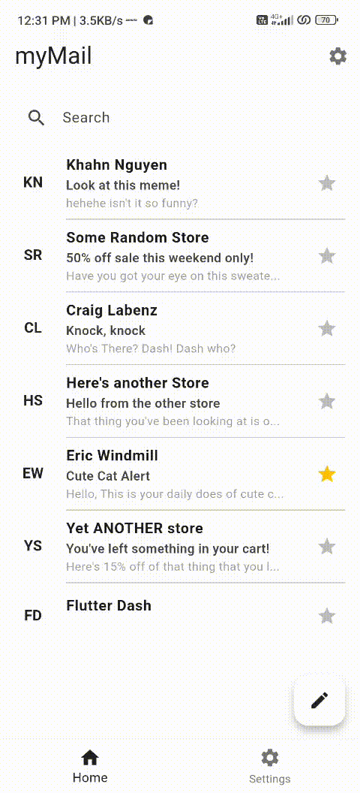

# 🤖 Agentic App Demo


A Flutter application demonstrating agentic AI capabilities with Firebase integration. This app showcases how to build intelligent, context-aware applications using Flutter and Firebase AI services.



## ✨ Features

- 🤖 AI-powered interactions using Firebase AI
- 📱 Cross-platform Flutter app (iOS & Android)
- 🔥 Firebase integration for backend services
- 🎯 BLoC pattern for state management
- 📊 Real-time data handling

## 🚀 Quick Start

### Prerequisites

- Flutter SDK (3.8.0 or higher)
- Dart SDK
- Firebase Project

### 📋 Setup Steps

#### 1. Clone the Repository
```bash
git clone https://github.com/your-username/agentic-app-demo-flutter.git
cd agentic-app-demo-flutter
```

#### 2. Install Dependencies
```bash
flutter pub get
```

#### 3. Firebase Configuration 🔥

**For Android:**
- Download `google-services.json` from your Firebase Console
- Place it in `android/app/google-services.json`

**For iOS:**
- Download `GoogleService-Info.plist` from your Firebase Console
- Place it in `ios/Runner/GoogleService-Info.plist`

**Firebase Console Steps:**
1. Go to [Firebase Console](https://console.firebase.google.com/)
2. Create a new project or select existing one
3. Enable Gemini Developer API in `AI Login`
4. Add Android/iOS app to your project
5. Download the configuration files
6. Place them in the correct directories as mentioned above

## 🛠️ Dependencies

- **flutter_bloc**: State management
- **firebase_core**: Firebase core functionality
- **firebase_ai**: Firebase AI services
- **equatable**: Value equality for Dart objects

## 🐛 Troubleshooting

### Common Issues

1. **Firebase configuration not found**
   - Ensure `google-services.json` and `GoogleService-Info.plist` are in the correct locations
   - Verify the Firebase project ID matches in your configuration

2. **Dependencies issues**
   - Run `flutter clean` followed by `flutter pub get`
   - Check Flutter and Dart SDK versions

3. **Build errors**
   - Ensure all Firebase services are properly configured
   - Check platform-specific setup requirements

## 🤝 Contributing

1. Fork the repository
2. Create a feature branch (`git checkout -b feature/amazing-feature`)
3. Commit your changes (`git commit -m 'Add amazing feature'`)
4. Push to the branch (`git push origin feature/amazing-feature`)
5. Open a Pull Request

## 📄 License

This project is licensed under the MIT License - see the [LICENSE](LICENSE) file for details.

**Happy coding! 🎉**

If you encounter any issues, please check the [troubleshooting section](#-troubleshooting) or create an issue in the repository.
